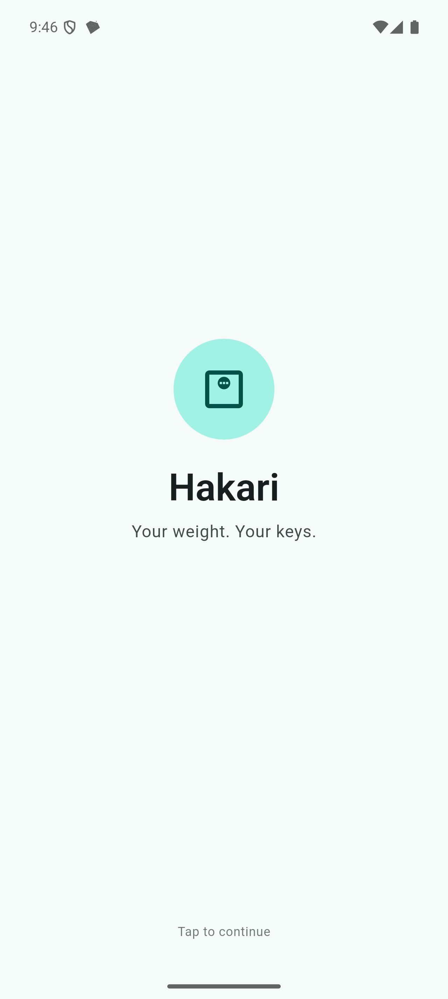
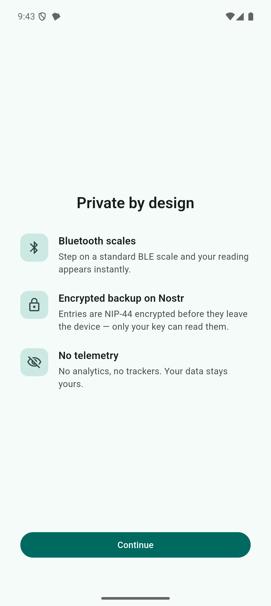
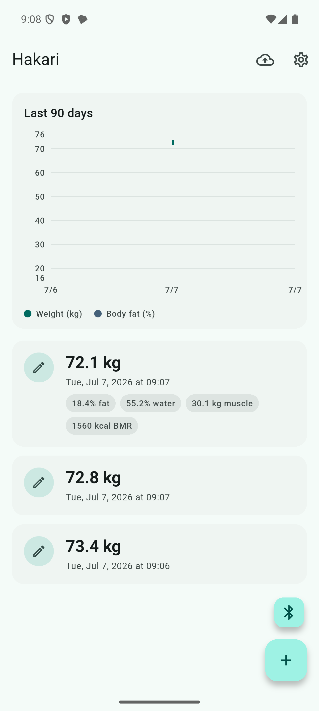
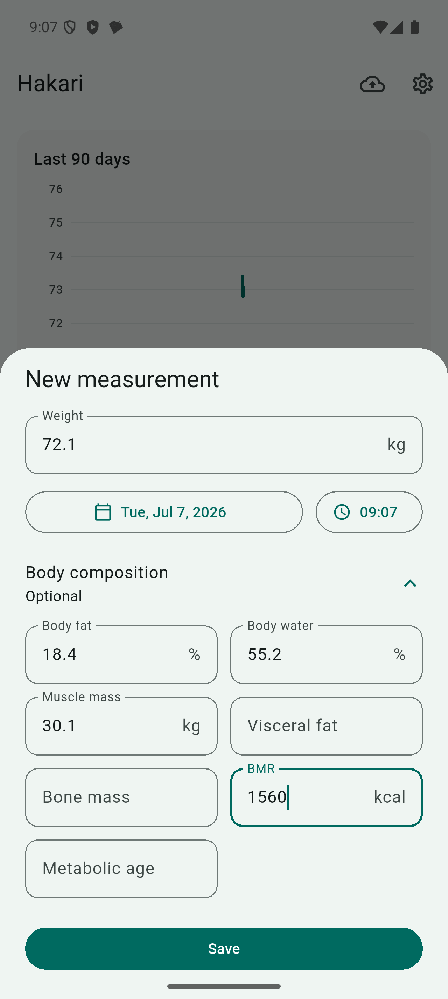
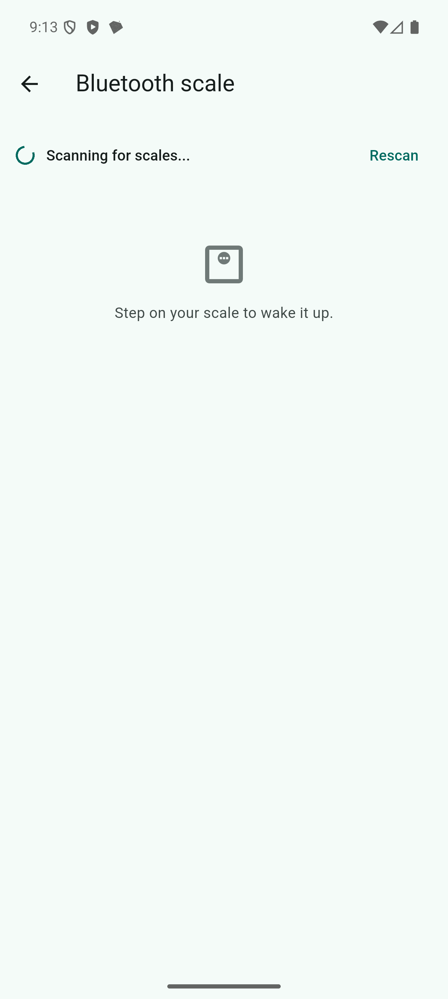
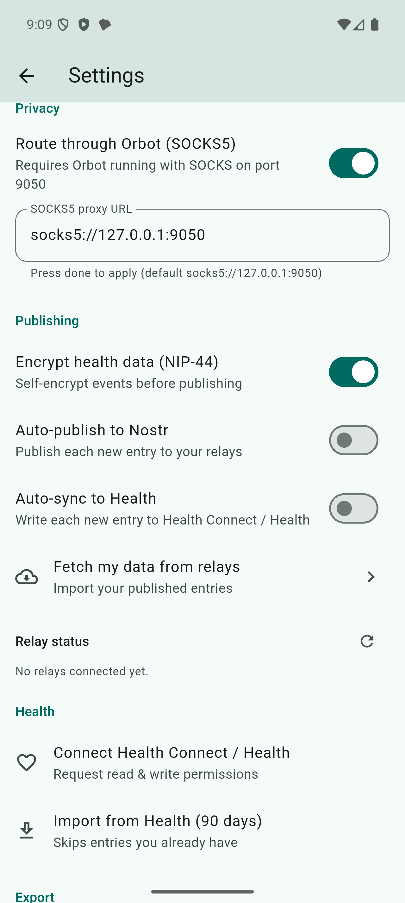
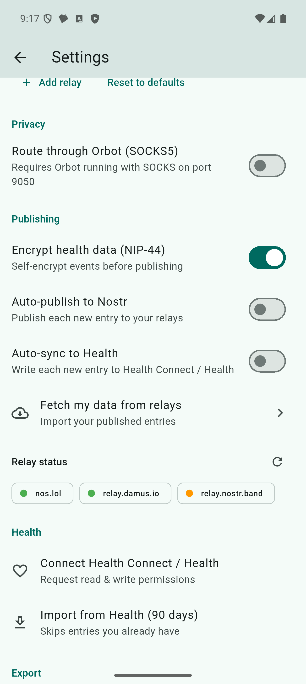
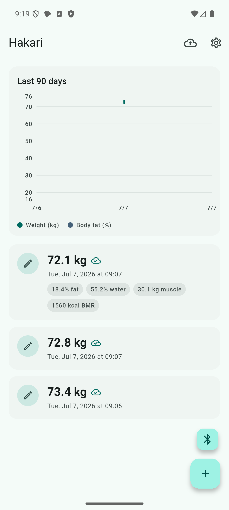

# Hakari（秤）

Privacy-first weight & body-composition logger — **Flutter × Rust FFI**, Nostr-native.

Inspired by [kochka/WeightLogger](https://github.com/kochka/WeightLogger) (feature set) and
[higedamc/meiso](https://github.com/higedamc/meiso) (architecture: flutter_rust_bridge 2.12 +
cargokit + nostr-sdk + Amber + Tor).

## Features

- **Measurements**: weight + full TANITA-style body composition (body fat %, body water %,
  muscle mass, visceral fat rating, bone mass, BMR, metabolic age), manual entry, 90-day trend chart.
- **BLE scales**: standard Bluetooth SIG Weight Scale Service (0x181D) and Body Composition
  Service (0x181B) with full 0x2A9D / 0x2A9C GATT parsing. Any scale exposing the standard
  services (including legacy HMM smartLAB "WS" units, as supported by WeightLogger) works
  end-to-end. For TANITA hardware see [TANITA compatibility](#tanita-compatibility) below.
- **Health Connect / Apple Health**: read & write weight and body fat (`health` 13.x),
  auto-sync on save, 90-day import with dedupe.
- **Nostr (NIP-101h)**: publishes each measurement as kind **1351** weight events
  (`unit`/`t:health`/`t:weight` tags) plus a kind **30078** (NIP-78) encrypted full-entry backup
  (`d = hakari:entry:<uuid>`), NIP-44 self-encrypted by default; restore via relay fetch.
- **Amber (NIP-55)**: login is Amber-only — external-signer event signing and NIP-44
  encrypt/decrypt via `nostrsigner:` intents + ContentProvider fallback, so the app never
  sees your secret key. First-run onboarding detects Amber, links to its releases page when
  missing, and is skippable (the app works fully offline; connect later from Settings).
- **Tor / Orbot**: relay websockets can be routed through Orbot's SOCKS5 proxy
  (`socks5://127.0.0.1:9050`, configurable) via nostr-sdk connection proxy.
- **Export**: WeightLogger-compatible CSV and versioned JSON backup, via system share sheet.
- **No telemetry.** No analytics, no crash reporting, no network calls other than the relays
  and health stores you configure.

## TANITA compatibility

Research findings that shaped the BLE design:

- **Modern TANITA consumer scales (BC-401/768, RD-9xx family) use a proprietary,
  account-bound BLE protocol.** They pair against TANITA's own apps and do not expose the
  standard GATT weight / body-composition services — even openScale does not support them.
- WeightLogger's "TANITA support" is likewise not BLE: it talks **ANT+** to the discontinued
  BC-1000.
- Hakari therefore ships the pragmatic split: **full support for any standard-GATT scale**,
  plus **detection-with-guidance for TANITA units** instead of a silent failure.

What happens with a real TANITA scale:

1. Open the Bluetooth scale screen (Bluetooth FAB on Home) — scanning starts automatically.
2. Step on the scale to wake it. TANITA units advertise as `TNT_...` / `TANITA...` and are
   recognized as scales, so the device shows up in the scan list.
3. Tapping it attempts a standard connection; because the proprietary protocol exposes no
   0x2A9D / 0x2A9C measurement characteristics, Hakari shows an explanatory message
   ("TANITA consumer scales use a proprietary protocol that cannot be read") instead of
   hanging or failing silently.

For first-class TANITA data, Hakari integrates the **Health Planet cloud API** (TANITA's
official OAuth REST API): Settings → *TANITA Health Planet* → Link opens the consent page
in the browser; paste the resulting `code=` value back into the app, then *Import from
Health Planet (90 days)* pulls weight, body fat %, muscle mass, visceral fat, BMR, body
age and bone mass (innerscan tags 6021–6029, measurement-date based, deduped). Tokens are
held in Keystore-backed secure storage. The OAuth client secret is pasted **once on the
device** when linking (stored in the Keystore, never in the APK or the repo); a
build-time `--dart-define=HP_CLIENT_SECRET=...` override also works for personal builds.
Note the measurement still reaches the cloud via the official TANITA app first — that is
inherent to these scales.

## Screenshots

Store-listing assets live in [`screenshots/`](screenshots/) (Pixel-class emulator, API 35):

| | | |
|---|---|---|
|  |  |  |
|  |  |  |
|  |  | |

## Architecture

```
lib/domain/        contracts: entities, repository/service interfaces, failures (Phase 0)
lib/core/di/       Riverpod DI seams (overridden in main.dart)
lib/data/          implementations: local (Hive), ble, health, signer (Amber), nostr (Rust FFI), export
lib/presentation/  Material 3 UI (Riverpod)
lib/bridge_generated/  flutter_rust_bridge 2.12 codegen (do not edit)
rust/              nostr core: nostr-sdk 0.37, NIP-101h event builders, relay pool, SOCKS5 proxy
cargokit/          vendored build tool — compiles the Rust crate per ABI during gradle build
```

The crate is named `rust` (→ `librust.so`); cargokit locates artifacts by cargo *package* name,
which must match the gradle `libname` and the FRB loader stem.

## Build

```bash
flutter pub get
flutter_rust_bridge_codegen generate   # only after changing rust/src/api.rs
flutter build apk --debug --target-platform android-arm64
```

Requires Rust with Android targets, NDK 28.0.13004108 (pinned in `android/app/build.gradle.kts`
and `rust/.cargo/config.toml`), minSdk 26 (Health Connect).

## Tests

```bash
flutter test          # 86 tests: GATT parsers, bech32, CSV, Hive repos, health mapping, NIP-101h codec
cd rust && cargo test # 10 tests: event kinds/tags, key roundtrip, NIP-44, proxy parsing, local signing
```
